# Gameplay Sections — new kinds of level beat, two per territory

Written 2026-09-28. A design proposal, not a build log: nothing here is
implemented yet. It extends the Missions v3 grammar in
[`MISSIONS_OUTDOOR.md`](MISSIONS_OUTDOOR.md) (shells × encounters, stages,
transport doors, the ceiling, guidance), and every rule in that document and in
[`LEVEL_DESIGN.md`](LEVEL_DESIGN.md) §5–§7 still holds unless a section below
says otherwise and why.

The run today has two volumes — the **wide outdoor zone** (`open`, `canyon`,
`road`, `deck`) and the **contained interior** (`hall`, `corridor`) — and one
set piece that plays differently from both, the `road`/`chase`. Every other beat
is *walk in, fight, walk out*, and what changes between territories is scenery.
This document adds eighteen beats that change **the verbs**: what you are doing
with your hands, where the camera is, what the clock is, what you are
protecting. Each territory gets two, chosen for its theme, and they are meant to
be **inserted** into the existing runs (or swapped for one existing beat each),
not to replace them — the outdoor-and-interior rhythm is still the spine.

Diagrams for each section live in [`sections/`](sections/). They are schematic
(top-down or side-on plans with the flow, hazards and spawns marked), drawn to
the dimensions in the text. Painted keyframes for all eighteen are requested in
[`ASSETS_IMAGES.md`](ASSETS_IMAGES.md#gameplay-sections--keyframe-concepts-2026-09-28).

## 0. At a glance

| # | Territory | Section | Kind | The new verb | Camera | Cost |
|---|---|---|---|---|---|---|
| 1 | Dune Sea | **The Barge Run** | moving-platform boarding | leap between moving hulls, take the deck gun | per-player | M |
| 2 | Dune Sea | **Worm Sign** | detection crossing | move quietly; rock-hop; plant a thumper decoy | per-player | M |
| 3 | Spice Run | **The Ring Walk** | on-rails walk, one screen | advance together along a curving hull | **shared rail** | L |
| 4 | Spice Run | **Guns of the Frigate** | turret defence | man a quad gun; leave it to repel boarders | per-player | M |
| 5 | Lava Flats | **The Magma Run** | vehicle combat lane | shoot from the saddle, swing at riders alongside | per-player | M |
| 6 | Lava Flats | **The Chimney** | rising-hazard climb | climb before the magma does | per-player | S |
| 7 | Crevasse | **The Glacier Chute** | momentum descent | slide, steer, jump crevasses — no brakes | per-player | M |
| 8 | Crevasse | **Lamplight** | darkness | your lamp is your weapon and your map | per-player | M |
| 9 | Storm Docks | **The Squall** | tilting deck holdout | brace for the wave, hold the deck | per-player | M |
| 10 | Storm Docks | **Run the Pier** | chase toward camera | outrun the thing behind you | **shared rail (reversed)** | S* |
| 11 | Refinery | **Lights Out** | stealth infiltration | stay out of the cone; take them from behind | per-player | M |
| 12 | Refinery | **The Line** | machine-floor gauntlet | ride belts, time crushers, fight on moving ground | per-player | M |
| 13 | Great Forge | **Covert Sky** | free flight | fly the whole beat; dogfight; bomb the guns | per-player | M |
| 14 | Great Forge | **Hold the Forge** | point defence | protect the Armorer until the beskar is made | per-player | S |
| 15 | Ringworld | **Tram Top** | train-roof fight | duck the gantries, hold the roof, jump trains | **shared rail** | M* |
| 16 | Ringworld | **The Mark Runs** | pursuit | keep the bounty in reach; bring him in alive | per-player | M |
| 17 | Prison Rig | **One Way Out** | riot with allies | free the blocks; lead a crowd over live floors | per-player | M |
| 18 | Prison Rig | **The Lift** | ascending holdout | hold a platform that is climbing a shaft | per-player | S |

Cost is engineering on top of what exists: **S** a week-ish of mostly authoring
on systems already in the game; **M** one new system plus authoring; **L** a new
system that touches rendering, input and HUD. An asterisk means the cost drops to
S once the section that builds its system first has shipped (the rail camera for
Run the Pier and Tram Top).

## 1. The section kit — nine systems, shared

Eighteen sections do not mean eighteen engines. Every section is built from the
existing zone machinery plus one or two of these nine systems, and most systems
serve three or more sections. Building in the order of §4 means each new system
unlocks several beats at once.

| Kit | What it is | Sections |
|---|---|---|
| **K1 Rail camera** | One full-screen camera on an authored spline that frames the whole party; players are leashed to its frame | Ring Walk, Run the Pier, Tram Top |
| **K2 Treadmill arena** | The platform stands still in physics; the *world* scrolls past it | Barge Run, Guns of the Frigate, Tram Top, The Lift |
| **K3 Mounted weapons** | Guns and blades used from a seat: turrets, vehicle cannons, a side swing from the saddle | Magma Run, Guns of the Frigate, Barge Run |
| **K4 Hazard front** | A plane or line that advances on a clock: rising magma, a collapsing pier | The Chimney, Run the Pier, Glacier Chute (the avalanche) |
| **K5 Objective with a bar** | Something that is not a player with HP or progress the HUD shows | Hold the Forge, Guns of the Frigate, One Way Out, The Mark Runs |
| **K6 Detection field** | A per-player meter fed by noise or light that turns into an alarm | Worm Sign, Lights Out |
| **K7 Locomotion modes** | Slide (no traction on a slope), sustained flight, deck tilt | Glacier Chute, Covert Sky, The Squall |
| **K8 Pursuit target** | A scripted runner on a path who reacts to distance and damage | The Mark Runs |
| **K9 Darkness** | Near-zero ambient; helmet lamps as spotlights; light as a mechanic | Lamplight |

### K1 — the rail camera, and why the shared camera is allowed back

`LEVEL_DESIGN.md` §6 cut the shared centroid camera for good reasons: walls and
crates split the party out of frame, and screen-relative aim meant nobody owned a
crosshair. Both failures came from putting one camera over a *room*. A rail
section is built so neither can happen:

- **The geometry is one lane.** A walkway 10–14 m wide (a hull spine, a pier, a
  tram roof) has nothing to hide behind that the camera cannot see over, so the
  party cannot be split out of frame by a wall. The camera rides an authored
  spline (`RailSpec.path`) beside or behind the lane and never cuts.
- **The frame is a leash.** The camera advances along its spline to keep the
  party's centroid at ~45% of the frame, clamped by its speed limit. The trailing
  edge of the frame is a soft wall: a player pushed against it is carried along
  (a gentle shove, never damage). A player who is dead or stuck when the leading
  edge crosses the next rail gate **re-forms at the gate** — the party is never
  split by more than one screen. The leading edge is a hard wall only when the
  section wants a fight held (a **lock**, like a Gauntlet arena: enemies arrive,
  the camera stops, clear to move on).
- **Aim is twin-stick, not screen-relative.** In a rail section the right stick
  stops orbiting (there is nothing to orbit) and instead **points the gun** in the
  ground plane, with the existing soft-lock pulling bolts onto the nearest target
  in that direction. Mouse: the cursor is a ground-plane reticle. LT still
  hard-locks the nearest target in the facing arc. Each player owns their own
  aim; the camera only owns the view.
- **The screen is merged, then split again.** Entering a rail section the
  viewports blend into one full-screen view over 0.6 s (each player's camera
  flies to the rail camera's pose, then the split lines fade), the per-player HUD
  panels collapse into one strip along the bottom with a portrait each, and the
  reverse happens at the exit gate. Solo play is the same path with one portrait.

Cost: `Game.render` gains a one-viewport path keyed by the active zone; input
gains a twin-stick mapping for the rail zone; the HUD gains a merged strip. This
is the one **L** in the kit, and it pays three times.

### K2 — the treadmill arena

Every "fight on a moving thing" beat is built the same way: **the thing does not
move**. The barge's deck, the frigate's hull, the tram's roof and the lift's
platform are static colliders; the dunes, the starfield, the city and the shaft
wall scroll past them (a scrolling ground strip with a UV offset, props on a
conveyor that recycles them behind the camera, a parallax skyline). This
sidesteps everything that makes moving platforms expensive — carried riders,
enemies pathing on a moving surface, bolts inheriting velocity, physics tunnelling
at speed — and every body on the platform uses the normal rules. Motion is sold
by wind lines, dust trails off the hull, scrolling shadows and a gentle sway on
the camera. Things that must *arrive* (an enemy skiff, a landing, a station
platform) are spawned ahead on the scroll and carried in by it.

`Mover` (in `world/board.ts`) stays the tool for things that move *relative to*
the arena — the skiff pulling alongside the barge, a boarding dropship's tube.

### K3 — mounted weapons

Today a ride stows the rider's weapons ("the vehicle is the weapon", PLAN.md
§17). Three sections want a seat that fights. One `Mount` interface covers all of
them: a seat with a **gun** (arc limits, rate, heat, damage, projectile kind)
and/or a **side swing** (the rider's own melee weapon, swung to one flank).

- **Turrets** (the frigate's quad guns, the barge's deck gun) are a ride that
  cannot move: board with Y, the camera goes to the gun's sight, RT fires, heat
  rises and vents, Y dismounts. It is the existing mount/dismount path.
- **Vehicle cannons** (the Magma Run bikes) fire along the nose inside a ±12°
  soft-lock cone; the hull's own `shotResist` and HP rules are unchanged.
- **The side swing** (the Magma Run) — the melee button swings the rider's own
  weapon (gaffi, saber, staff, spear, whatever the character carries) at a rider
  alongside, to whichever flank the nearest target is on, the stick's lean
  overriding. It lands on the *rider*, not the hull; a knocked rider comes out of
  the saddle and their ride keeps going driverless (existing rule), which over
  lava is the end of it.

### K4–K9 in one line each

- **K4 hazard front** — a plane (`y = y0 + rate·t`) or a line along a path that
  kills or knocks back on contact, with a telegraph band ahead of it (glow,
  cracking, a sound that rises). Pauses and speed-ups are authored events.
- **K5 objective with a bar** — an entity on team 0 with HP (the Armorer, the
  frigate's hull, a prisoner crowd's headcount) or a progress value, shown on
  the HUD objective line; enemies get a target-weight toward it.
- **K6 detection field** — a per-player meter (0–1) fed by noise (running,
  firing, jetpacking, landing) or by light (standing in a cone); thresholds fire
  events. The awareness system already has the states it needs to answer.
- **K7 locomotion modes** — `slide` (traction ≈ 0.03 and gravity along the
  slope, steering as lateral force, a crouched surf pose), `flight` (the jetpack
  with no fuel cost and a raised ceiling), `tilt` (a lateral acceleration on
  every body proportional to deck roll — no rotating colliders).
- **K8 pursuit target** — an enemy on a path script with its own speed curve
  that reacts to the gap to the nearest player (slows when far, sprints when
  close) and to hits (stagger, change route at a fork).
- **K9 darkness** — ambient and hemisphere light near zero, fog close and black,
  a `SpotLight` on each player's helmet (four at most), emissive props as the
  only other light.

## 2. The eighteen sections

Each section gives the fantasy, where it goes in the territory's existing run,
the layout (dimensions are in metres and drawn to the diagrams), how it plays,
how it works at one to four players, the camera, what failing costs, and what is
reused versus new.

---

### 2.1 The Barge Run — Dune Sea · moving-platform boarding

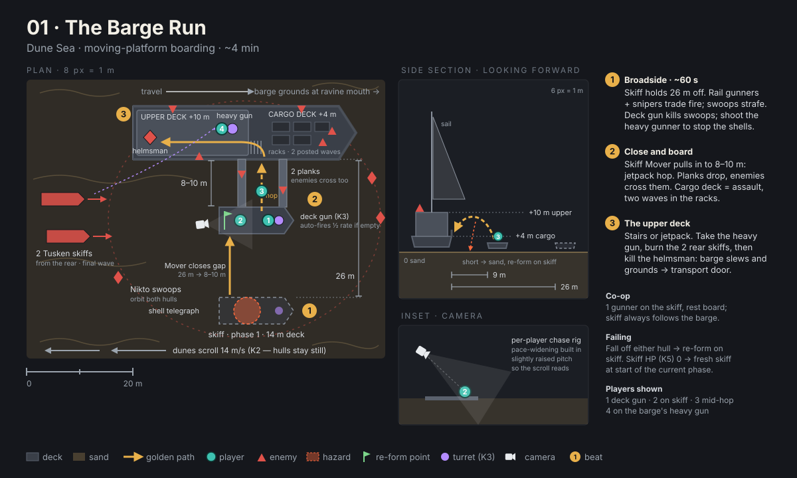

**The fantasy.** A Tusken-crewed sail barge under full sail across the Dune Sea,
the party chasing it on a skiff, closing the gap under fire and jumping across
the sand to take it deck by deck.

**Where it goes.** Replaces the Dune Sea's `road`/`chase` (stage A, beat 2) —
the dune road becomes a dune *sea*: the party is on a skiff instead of choosing a
ride, and the barge is the barricade. The barge grounds itself at the ravine
mouth, which is where stage A already ends.

**Layout.** A treadmill arena (K2). The **skiff** (the delivered `skiff`, 14 m
deck) runs parallel to the **sail barge** (`sail_barge`, 42 m long, two decks:
the lower cargo deck at +4 m, the upper deck at +10 m with the helm aft). The
dunes scroll under both at 14 m/s. The gap between the hulls is a `Mover`
offset on the skiff: 26 m in phase 1, 8–10 m in phase 2. Nikto swoops orbit
both hulls.

**How it plays.**

1. **Broadside** (~60 s). The skiff holds 26 m off. Barge deck gunners and
   Tusken snipers on the rail trade fire with the party; swoops strafe the skiff.
   The skiff's own **deck gun** (K3 turret) is the tool for the swoops. The
   skiff has HP (K5) — it is the party's ride, so the barge's heavy gun lobs
   telegraphed shells at it and the party shoots the gunner to stop them.
2. **Close and board.** The skiff pulls in to 8–10 m (a comfortable jetpack hop;
   a jump short and you fall to the sand, re-form on the skiff). Two boarding
   planks drop from the barge's rail; enemies come *across* them too. Everyone
   who reaches the barge's lower deck is in a normal assault (two waves posted
   in the cargo racks).
3. **The upper deck.** Stairs and the jetpack both reach it. The barge's
   **heavy gun** is here — take it (K3 turret) and turn it on the two pursuing
   Tusken skiffs that come in from the rear as the final wave. When they burn
   the barge's helmsman is the last target: kill him and the barge slews,
   grounding at the ravine mouth. Transport door beat follows as today.

**Co-op.** Solo: the skiff's deck gun has an auto-fire mode while nobody sits in
it, at half rate, so a solo player can board without the skiff dying behind
them. Three or four: the natural split is one gunner on the skiff, the rest
boarding — and the skiff is never "left behind", it follows the barge.

**Camera.** Per-player, with the chase rig's pace-widening already built in; the
scrolling ground reads best at a slightly raised pitch.

**Failing.** Falling off either hull re-forms you on the skiff (off-path rule).
If the skiff's HP hits 0 it breaks up and the party re-forms on a fresh one at
the start of whichever phase they were in.

**Built from.** `skiff`, `sail_barge`, `nikto_swoop`, `tusken`, the assault
encounter. **New:** K2 (the scrolling dune strip), K3 (two turrets), the skiff
offset `Mover`. Length ~4 min.

---

### 2.2 Worm Sign — Dune Sea · detection crossing

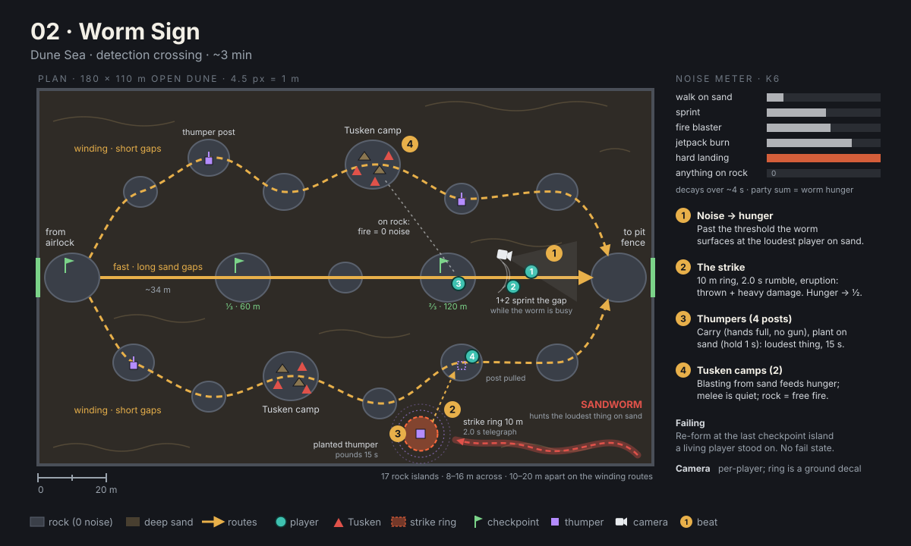

**The fantasy.** Open sand, rock islands, and something enormous under the
dunes that hunts by sound. Crossing it is about *how* you move, not how you
shoot.

**Where it goes.** Stage C, before the fighting pit (beat 6): the worm that
hunts the crossing is the sandworm the party then fights as the lieutenant, so
this is its introduction. Between the airlock and the pit's fence.

**Layout.** An `open` shell, 180 × 110 m of deep dune, crossed along its long
axis. Seventeen **rock islands** (8–16 m across, 10–20 m apart) form three loose
routes: a fast straight route with long sand gaps, and two winding ones with
short gaps. Tusken **thumper posts** stand on four islands. Two Tusken camps on
the larger islands.

**How it plays.**

- **Noise** (K6). Every player has a noise meter: walking on sand adds a
  little, sprinting a lot, firing a blaster a lot, a jetpack burn more, a hard
  landing a spike. Standing on rock adds nothing. The meter decays over ~4 s.
  The party's **sum** is the worm's hunger; the worm surfaces toward the **loudest
  player on sand** when hunger crosses a threshold.
- **The strike.** A ring of rippling sand 10 m across forms under the target
  (2.0 s telegraph, a low rising rumble), then the worm erupts through it.
  Anyone in the ring is thrown and takes heavy damage; the worm sinks back and the
  hunger resets to half. Get to rock or get out of the ring.
- **Thumpers.** The thumper posts can be pulled and carried (occupies your
  hands: no gun, like carrying a barrel) and planted on sand (hold interact,
  1 s). A planted thumper pounds for 15 s and *is* the loudest thing on the
  sand — the worm goes for it. It is the crossing's clever tool: plant one on the
  flank and run the straight route while the worm is busy.
- **The Tuskens are the dilemma.** The camps on the islands are posted garrisons
  (camp encounter). Blasting them is loud and pumps the hunger of whoever is on
  sand; melee is quiet. A player on rock can shoot freely — the noise only
  counts from sand — so a covering player on a rock island is a real role.

**Co-op.** Solo: hunger thresholds scale down with party size so the worm does
not ignore a quiet solo player; alone, the thumper is how you create an opening.
In a group the loudest player draws the worm, which makes "I'll draw it, you
cross" a play people will find on their own.

**Camera.** Per-player. The sand ring is a ground decal readable from any angle.

**Failing.** Death re-forms at the last rock island any living player stood on
that has a checkpoint marker (three of them, at the thirds). No fail state.

**Built from.** `sandworm` (its eruption and burrow are already its lieutenant
moves), `tusken`, `tusken_tent`, the camp encounter, boulders. **New:** K6 noise,
the thumper carry/plant, the worm's hunt-by-noise controller (a small state
machine driving the existing sandworm between burrowed and erupting). Length
~3 min.

---

### 2.3 The Ring Walk — Spice Run · on-rails, one screen

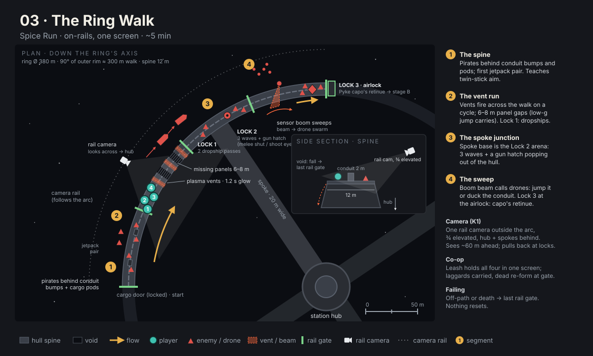

**The fantasy.** Walking the outer rim of a slowly turning habitat ring in open
space, the station's spokes wheeling overhead, the horizon of the hull curving
away so that whatever is next rises over it — all four hunters in one shot, like
a side-scrolling brawler in three dimensions.

**Where it goes.** A new stage between stage A (the approach) and stage B
(inside the station): the outer yard's cargo door no longer opens straight into
the vault; the party is locked out and has to walk a quarter of the ring to the
next airlock. Stage B then starts at that airlock.

**Layout.** The ring is 380 m in diameter; the party walks a 90° arc of its
outer rim — about **300 m** of walkway — on a hull spine 12 m wide with a 2 m
raised conduit down the middle (hop-able, blocks bolts, a lane divider). The
curvature does the level design: from any point you see ~60 m ahead before the
hull drops away, so pylons, gun hatches and dropships **rise over the horizon**
as you advance. The ring's own gravity plating holds you to the hull ("the
hull's field"): stepping off the spine's edges is a fall into the void and a
re-form at the last rail gate.

**How it plays.** Four segments separated by three **locks** (K1: the camera
stops, the frame closes, a wave arrives, clear to advance):

1. **The spine** — pirates posted behind conduit bumps and cargo pods, a first
   jetpack pirate pair. Teaches the twin-stick aim.
2. **The vent run** — **plasma vents** in the hull fire across the walkway on a
   cycle (telegraph: a red glow in the grate for 1.2 s); gaps where panels are
   missing (6–8 m, the low gravity makes a jump carry). Lock 1: two dropship
   passes.
3. **The spoke junction** — a spoke 20 m wide rises out of the ring into the
   sky; its base is the arena for Lock 2 (three waves, a **gun hatch** turret
   that pops out of the hull and must be meleed shut or shot in its open eye).
4. **The sweep** — a **sensor boom** sweeps the walkway like a clock hand; being
   caught by the beam calls down drone swarms (interceptor drones) — jump it or
   duck behind the conduit. Lock 3 at the airlock: the Pyke capo's retinue.

**Co-op.** This is the section that is *best* at four: one screen, everyone
visible, the Gauntlet feel the LEVEL_DESIGN research was chasing. The leash (K1)
keeps the party within one screen; a lagging player is carried, a dead one
re-forms at the next gate.

**Camera.** The **rail camera**: set off the ring's outer side, 3/4 elevated,
looking across the walkway toward the station's hub, following the arc. The
station's hub and spokes fill the background — that is the postcard. At locks the
camera pulls back to frame the whole arena.

**Failing.** Off-path and death re-form at the last rail gate; nothing resets.

**Built from.** Pirates, jetpack pirates, dropships, `interceptor_drone`,
`hull_plate_large` + glow, the low-gravity pads. **New:** K1 (the rail camera,
merged HUD, twin-stick aim), a ring-segment builder (a torus section with the
spine's colliders laid on its surface as a chain of short boxes), the vent and
boom hazards. Length ~5 min.

---

### 2.4 Guns of the Frigate — Spice Run · turret defence

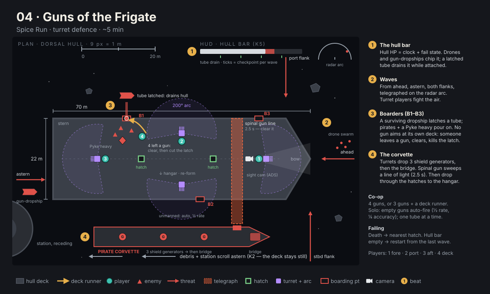

**The fantasy.** The party has taken the spice frigate and is breaking away from
the station, and every pirate who can fly is coming after it. Four quad guns on
the dorsal hull, and boarding tubes latching on below.

**Where it goes.** Stage C, replacing the reactor ring assault (beat 7): the
party boards the frigate from the crew catwalks and the warlord's "hold of the
prize" becomes the frigate's hangar deck, reached at the end.

**Layout.** The frigate's dorsal hull (`spice_run_frigate`) as a 70 × 22 m deck
under the stars — a treadmill arena (K2): asteroids, station debris and the
station itself scroll away behind. **Four quad-gun turrets** (K3) in a diamond on
the hull, each with a 200° arc. Three **boarding points** along the hull edges
where pirate dropships latch. Two hull hatches lead down to the hangar deck.

**How it plays.**

- **The hull bar** (K5). The frigate's hull HP is the section's clock and its
  fail state. Interceptor drone swarms and gun-dropships chip it; a latched
  boarding tube drains it steadily while it is attached.
- **Waves** come from ahead, astern and both flanks, telegraphed by a radar
  arc on the HUD. Turret players fight the air.
- **Boarders.** A dropship that survives its run latches a tube onto a boarding
  point, and pirates (and a Pyke heavy) pour onto the hull. Nobody in a turret can
  aim at their own deck, so someone has to **leave a gun** to clear them — then
  kill the tube's latch (melee it, or a rocket) to cut it loose.
- **The corvette** (the finale). A pirate corvette pulls alongside with three
  shield generators and a spinal gun that charges across the hull (telegraph: a
  line of light on the deck, 2.5 s — clear the line). Knock out the generators
  with the turrets, then its bridge. It breaks away burning, and the party drops
  through the hatches to the hangar.

**Co-op.** Four players, four guns — or three guns and a deck runner. Solo: an
unmanned gun fires on its own at half rate and a quarter of the accuracy, and
boarders arrive one tube at a time. The fun is the constant *should I leave my
gun* decision.

**Camera.** Per-player; a seated turret takes the gun's sight camera (a chase rig
parented to the gun, with the ADS framing).

**Failing.** Death re-forms at the nearest hatch after the normal wait. If the
hull bar empties, the section restarts from its last wave (a checkpoint every
wave).

**Built from.** `spice_run_frigate`, `raider_dropship`, `interceptor_drone`,
pirates, the Pyke capo, 0.45 g. **New:** K2 (the scroll), K3 (turrets), K5 (the
hull bar), the boarding tube, the corvette as a set-piece boss. Length ~5 min.

---

### 2.5 The Magma Run — Lava Flats · vehicle combat lane

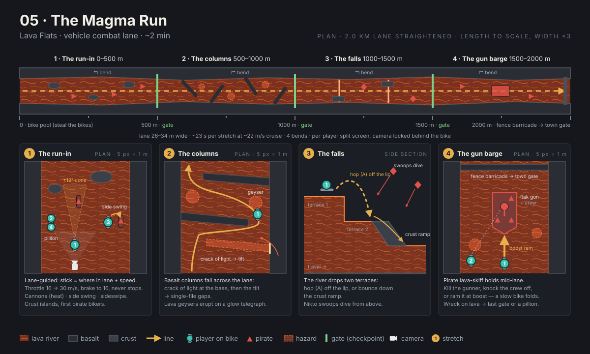

**The fantasy.** Speeder bikes flat out down a river of lava in a basalt canyon,
pirate bikers pulling alongside, twin cannons on the nose and a blade in your
free hand for anyone who gets close enough.

**Where it goes.** Replaces the crust causeway (stage A, beat 2) — the road
becomes the river, and the bike pool in the ash flats is where the party steals
the bikes (the camp rule stands). It ends at the town gate as now.

**Layout.** A `road`-family shell, **2.0 km** long and 26–34 m wide, down a lava
river between basalt walls — its own stage, since no zone chain is that long. The river *is* the floor: repulsors ride over it at
ride height, so lava only hurts a body without a bike under it. The lane bends
four times, and has four set-piece stretches separated by gates (checkpoints):

1. **The run-in** (0–500 m) — open lava, crust islands as obstacles, the first
   pirate bikers.
2. **The columns** (500–1000 m) — basalt columns fall across the lane
   (telegraph: a crack of light at the base, then the tilt), making
   single-file gaps. **Lava geysers** erupt on a glow telegraph.
3. **The falls** (1000–1500 m) — the river drops two terraces; hop (A) off the
   lip or bounce down the crust ramp. Swoops dive from above.
4. **The gun barge** (1500–2000 m) — a pirate lava-skiff with a flak gun and a
   crew, holding the middle of the lane. Kill the gunner, knock the crew off,
   or ram it with a boost (it is heavy — the mass rule will fold a bike that
   hits it slow). The fence barricade at the far mouth follows.

**How it plays.** The bike is **lane-guided**: it rides a spline down the river
with its lateral offset free inside the lane, so the player's job is *where in
the lane*, *how fast*, and *who to hit*, never "which way is the level". Stick
forward is throttle (cruise 22, up to 30 m/s), back is brake down to 16 (never
stop — the spline carries you), left/right is lean. LB boost, A hop and RB shield are as on
any ride.

- **Cannons** (K3). RT fires twin nose cannons in a ±12° soft-lock cone. Heat
  vents if you hold it.
- **The side swing** (K3). The melee button swings the rider's own weapon at a
  rider alongside — the flank with the nearest target, or the flank the stick is
  leaning. A hit knocks the rider out of the saddle; their bike runs on
  driverless and, over lava, it goes in. Every character gets their own swing:
  Din's spear, Maul's staff, a gaffi stick, a saber. It is the "Road Rash" move,
  and it is the most satisfying kill in the section on purpose.
- **Sideswipe.** Double-tap lean shoves your bike sideways into a neighbour —
  the existing ride-on-ride mass rule does the rest.
- **Enemy riders** use the existing `Enemy.updateRiding`, with a lane-guided
  brain: match speed alongside a player, swing or fire, peel off.

**Co-op.** Per-player split screen. A **pillion seat**: a second player can ride
behind a driver (Y at a teammate's bike) and gets the cannons and both flanks'
swings while the driver only drives — the way a player who wrecked gets back
into the run without waiting, and a genuinely good way to play it with a less
confident driver.

**Camera.** Per-player, locked behind the bike (the "eases behind the nose"
rule, but firmer — no free look while riding the lane; the right stick nudges the
view a few degrees for the cannon aim).

**Failing.** Wreck and you are thrown — onto crust you survive, onto lava you
re-form at the last gate on a fresh bike (or hop on a teammate's pillion if one
passes you, which is faster). Nothing resets for anyone else.

**Built from.** `speeder_bike`, `nikto_swoop`, `skiff` (as the gun barge),
pirates, the vehicle system, `lava_flow`, `cliff_basalt`. **New:** K3 (the
cannon, the side swing, the pillion), the lane-guided mode on the vehicle
(`Vehicle.lane: SplineLane`), the column and geyser hazards. Length ~2 min.

---

### 2.6 The Chimney — Lava Flats · rising-hazard climb

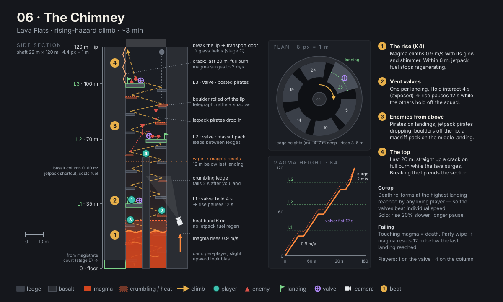

**The fantasy.** Deep under the garrison, a lava vent floods, and the only way
out is up — a basalt chimney 120 m tall, magma rising behind you, the sky a coin
of light at the top.

**Where it goes.** Stage B → C: the magistrate court's far door opens onto the
chimney's floor instead of straight onto the glass fields; the chimney's top is
the glass fields' entry.

**Layout.** A vertical shaft 22 m across and **120 m** high (its own stage, so
the ceiling is its lip). A spiral of basalt **ledges** climbs the wall — 4–7 m
wide, 3–6 m rises between them, with short gaps; some ledges are **crumbling**
(fall 2 s after you land). Three **landings** (bigger shelves) at 35, 70 and
100 m are checkpoints and fight stops. A central **basalt column** stands in the
middle for the lower half — a jetpack shortcut that costs fuel.

**How it plays.**

- **The rise** (K4). The magma surface rises at 0.9 m/s. Its glow and heat
  shimmer climb with it. Within 6 m of it jetpack fuel stops regenerating — the
  heat is the pressure, not just the lava.
- **Vent valves.** Each landing has a valve wheel: one player holds interact
  (4 s, exposed) to **pause** the rise for 12 s. It is the co-op beat: someone
  turns the wheel while the others hold off the posted squad.
- **Enemies** come from above: pirates on the landings, jetpack pirates
  dropping, **boulders** rolled off the lip (telegraph: rattle and a shadow). A
  massiff pack on the middle landing leaps between ledges.
- **The top.** The last 20 m is a straight climb up a crack — full burn — and the
  lava *surges* (2 m/s) for the finale. Breaking the lip is the transport door.

**Co-op.** The magma rises for everyone; a death re-forms at the highest
checkpoint reached by *any* living player (so nobody is left in the lava), which
is why the valves matter more than individual speed. Solo: the rise is 20%
slower and the valve pause is longer.

**Camera.** Per-player; the rig's collision already handles a shaft wall. A
subtle upward look bias while climbing keeps the next ledge in frame.

**Failing.** Touching the magma is death; re-form at the highest landing reached.
If everyone dies the magma resets to 12 m below the last landing.

**Built from.** Basalt rims (`cliff_basalt`), `lava_flow`, the ceiling and
fuel systems, pirates, jetpack pirates, `massiff`. **New:** K4 (the rising
plane), valve interact, crumbling ledges. The cheapest section in the document.
Length ~3 min.

---

### 2.7 The Glacier Chute — Crevasse · momentum descent

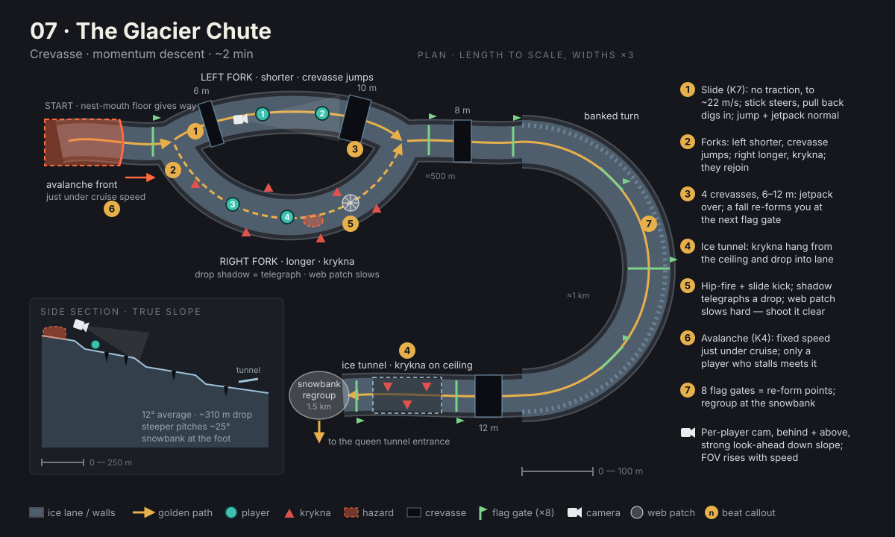

**The fantasy.** The ice shelf gives way and the party goes down a glacier on
their boots — a bobsleigh run of blue ice, crevasses opening ahead, spiders
dropping from the walls, an avalanche on their heels.

**Where it goes.** Stage A → B: instead of a door in the nest mouth, the nest
mouth's floor fractures and the chute is the way down into the deep. It ends in
a snowbank at the queen tunnel's entrance.

**Layout.** A descending ice channel **1.5 km** long, 12–20 m wide, 12° average
slope with steeper drops; banked turns (walls you can ride up); two **forks**
(left is shorter with crevasse jumps, right is longer and full of spiders — they
rejoin); four crevasses (6–12 m) and one ice **tunnel** with a ceiling where
krykna hang.

**How it plays.**

- **Slide** (K7). Traction drops to near zero and gravity pulls you down the
  slope at up to ~22 m/s. The stick steers (a lateral force) and can check speed a
  little by digging in (pull back: drag, not a stop). Jump and jetpack work
  normally — the jetpack is how you clear a crevasse or pop over an ice ridge.
- **Fighting while sliding.** The blaster works (hip-fire only, aim assist up
  one notch); the melee button is a **slide kick** that knocks a krykna off the
  wall or out of your lane. Spiders drop in front of you (shadow telegraph) and
  web the lane (a web patch slows you hard — shoot it to clear).
- **The avalanche** (K4). A front of snow follows the party down at a fixed
  speed a little under the slide's cruise. Only a player who stalls (hung up on a
  wall, webbed and not shooting, stopped to fight) meets it.

**Co-op.** Per-player split screen; everyone slides their own line. A player who
goes down a crevasse or into the avalanche re-forms at the next **flag gate**
(eight along the route) — the run continues for the others, and the regroup is
the snowbank at the bottom.

**Camera.** Per-player, locked behind and above with a strong look-ahead down
the slope; FOV rises with speed (the existing sprint kick, stronger).

**Failing.** Nothing resets. The only real failure is losing time; the only
cost of a fall is missing a stretch.

**Built from.** `cliff_ice`, `ice_albedo`, `krykna`, the webbing krykna already
spit, traction per stage. **New:** K7 slide state and its pose, K4 avalanche
front, the chute builder (a banked spline channel). Length ~2 min.

---

### 2.8 Lamplight — Crevasse · darkness

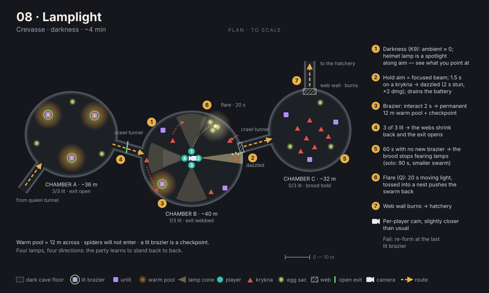

**The fantasy.** The brood's inner caverns, pitch dark, and the only light is
the lamp on your helmet — the thing in the dark is afraid of it, until there are
too many of them to be afraid.

**Where it goes.** Stage B, between the queen tunnel and the hatchery (beats 4 →
5): the hatchery is reached through the dark instead of a corridor.

**Layout.** An `interior` cavern stage of three chambers joined by crawl-high
tunnels, each chamber 30–40 m across with a web-hung roof. **Egg sacs** glow
faintly (the only other light). Three **braziers** (fuel pots) per chamber can be
lit. The exit to the hatchery is sealed by a web wall that burns.

**How it plays.**

- **Darkness** (K9). Ambient light near zero. Each player has a helmet lamp: a
  spotlight cone along the camera's aim. The lamp is the minimap: you see what
  you point at.
- **Light as a weapon.** Krykna avoid a lamp cone — they back off, circle, try
  to flank. **Holding aim focuses the beam** (narrower, brighter): a krykna
  caught in a focused beam for 1.5 s is **dazzled** (stunned 2 s, double damage).
  Focusing drains a battery bar; it recharges when unfocused.
- **Braziers.** Lighting a brazier (interact, 2 s) makes a permanent pool of
  warm light 12 m across: spiders will not enter it, and it is a checkpoint.
  Lighting all three in a chamber opens its exit (the webs shrink back from the
  heat). It is the way progress is measured.
- **The swarm.** The longer a chamber stays dark, the bolder they get: after
  60 s without a new brazier lit, the chamber's brood stops fearing the lamp.
- **Flares.** In this section the rocket slot (Q) throws a **flare** instead —
  a 20 s moving light source you can toss into a nest to push a swarm back.

**Co-op.** Four lamps pointing in four directions is the safest way through, and
the party learns to stand back to back without being told. Solo: the brood's
boldness timer is 90 s and the swarm is smaller.

**Camera.** Per-player, slightly closer than usual (claustrophobia, and the
cone reads better).

**Failing.** Re-form at the last lit brazier.

**Built from.** `krykna`, `krykna_brood` (egg sacs), the enemy awareness states
(avoid = a flee vector from the cone), the interior stage. **New:** K9 (lamps and
the dark stage), the fear/dazzle rule, braziers, the flare. Performance note:
four shadowless spotlights is within budget; the flare is a point light pooled
at two. Length ~4 min.

---

### 2.9 The Squall — Storm Docks · tilting deck holdout

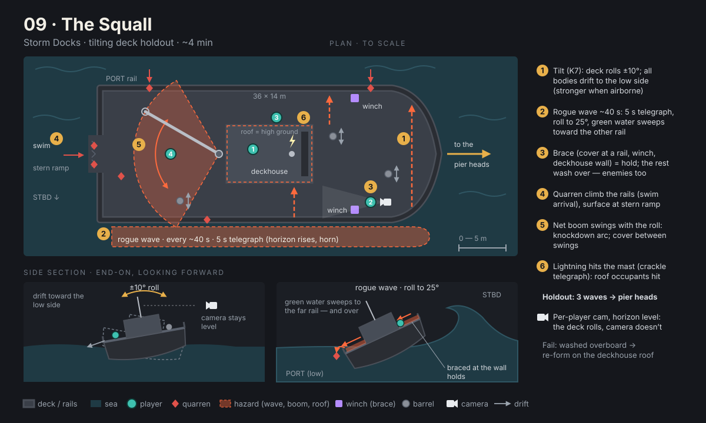

**The fantasy.** A trawler in a storm, the deck heeling under you, green water
coming over the rail, quarren climbing up out of the sea, and the net boom
swinging loose across it all.

**Where it goes.** Replaces the trawler deck assault (beat 6) — the trawler is
no longer moored; it is under way to the pier heads, and the harbour crossing
that MISSIONS_OUTDOOR §3.5 deferred becomes this.

**Layout.** The `trawler` deck, 36 × 14 m, with its deckhouse amidships (cover,
and its roof is the high ground), the net boom over the stern, and rails both
sides. The sea (`sea_surface`) all round, with a heavy swell.

**How it plays.**

- **The tilt** (K7). The deck rolls ±10° on the swell — a lateral acceleration
  on every body toward the low side (players, enemies, loose crates and
  barrels). You feel it as a drift, stronger when you are airborne.
- **Rogue waves.** Every ~40 s the horizon on one side rises (5 s telegraph, a
  horn from the wheelhouse): the roll goes to 25° and **green water** sweeps the
  deck toward the other rail. A player braced (the cover button near a rail, a
  winch, or the deckhouse wall — the existing snap-to-cover) holds. Anyone
  else is washed toward the far rail and over it if nothing stops them. Enemies
  too — a wave is a weapon if you time it.
- **Boarders.** Quarren climb the rails (arrival `swim`, already built) and
  surface at the stern ramp. The **net boom** swings loose across the deck with
  the roll — a moving sweep that knocks down whoever is in its arc, and a thing
  to hide behind between swings.
- **Lightning** strikes the mast (telegraph: a crackle along the rigging);
  whoever is on the deckhouse roof then is hit.
- **Holdout.** Three waves; the trawler reaches the pier heads when the third
  clears.

**Co-op.** The wave telegraph gives everyone the same five seconds, and calling
"wave!" is the co-op beat. Solo: waves are rarer and boarders fewer.

**Camera.** Per-player, with the horizon *not* rolled (the deck rolls, the
camera stays level — much more readable and much less nauseating).

**Failing.** Washed overboard: the existing *the harbour took you* beat, re-form
on the deckhouse roof.

**Built from.** `trawler`, `quarren`, the swim arrival, `sea_surface`, the cover
system (brace), barrels. **New:** K7 tilt (one lateral acceleration term on
every body, plus the mesh roll), the rogue wave push, the boom sweep. Length
~4 min.

---

### 2.10 Run the Pier — Storm Docks · chase toward the camera

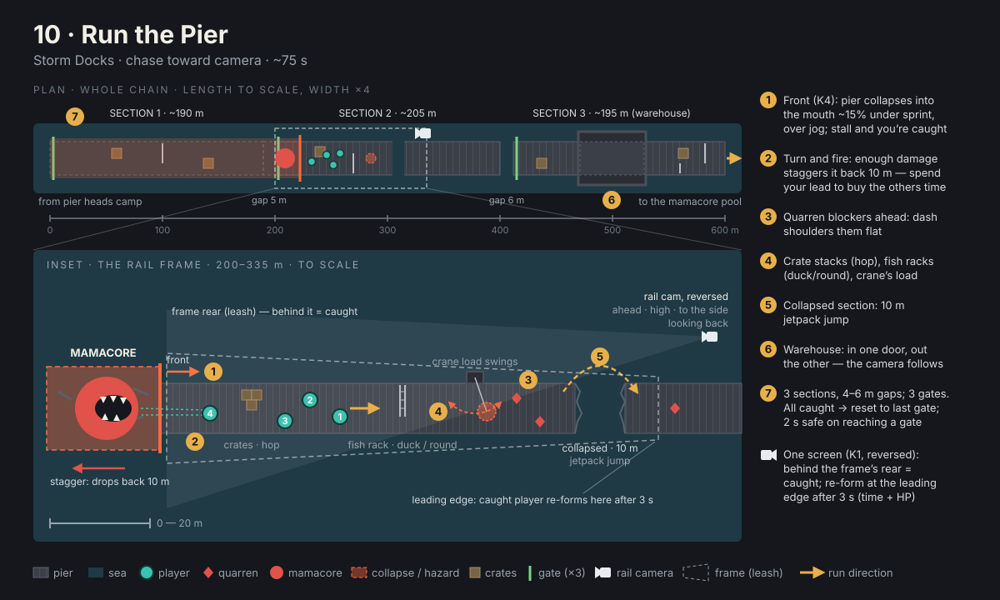

**The fantasy.** The mamacore breaks out early. The camera is in front of you,
looking back at four hunters sprinting toward it and a monster's mouth coming
through the pier behind them.

**Where it goes.** Between the pier heads camp (beat 7) and the mamacore pool
(beat 8): the mamacore's first appearance, before it is fought in its pool.

**Layout.** A **pier chain 600 m long**, 10 m wide, in three sections joined by
short jumps (4–6 m gaps where the planks are gone). Obstacles: crate stacks
(hop), fish racks (duck through or go round), a crane's swinging load, a
collapsed section that forces a jetpack jump across 10 m, and a warehouse that
the run goes *through* (in one door, out the other — the camera follows).

**How it plays.**

- **The front** (K4). The mamacore surges along under the pier, and the pier
  collapses behind the party into its mouth at a fixed speed, about 15% slower
  than a sprint and slightly faster than a jog. A player who stalls is caught.
- **Hitting back.** A player can turn and fire into the mouth: enough damage
  in a window **staggers** it (it drops back 10 m). It is the co-op trade — one
  player spends their lead to buy the others time.
- **Blockers ahead.** Quarren on the pier ahead are in view (the camera sits
  high and a little to the side, so ahead-of-party is in frame) — they need
  shouldering through (the dash knocks a quarren flat) rather than a gunfight.

**Co-op.** One screen (K1, reversed): the leash matters more here than
anywhere — a player who falls behind the rear of the frame is caught; a caught
player re-forms at the leading edge after 3 s, so being caught costs time and
hit points, not the run.

**Camera.** The **rail camera, reversed**: ahead of the party, elevated,
looking back down the pier, the mamacore behind them in shot. The whole reason
the section exists is this view.

**Failing.** Only if *everyone* is caught: the pier resets to the last gate
(three gates). The front never catches a player standing on a gate for 2 s after
reaching it (breathing room).

**Built from.** `mamacore` (its emerge and bite), `dock_planks`, `fish_rack`,
`cargo_crate`, `quarren`, `warehouse_wall`. **New:** K4 collapse front, the
reversed rail camera (K1 again). Cheap once K1 exists. Length ~75 s.

---

### 2.11 Lights Out — Refinery · stealth infiltration

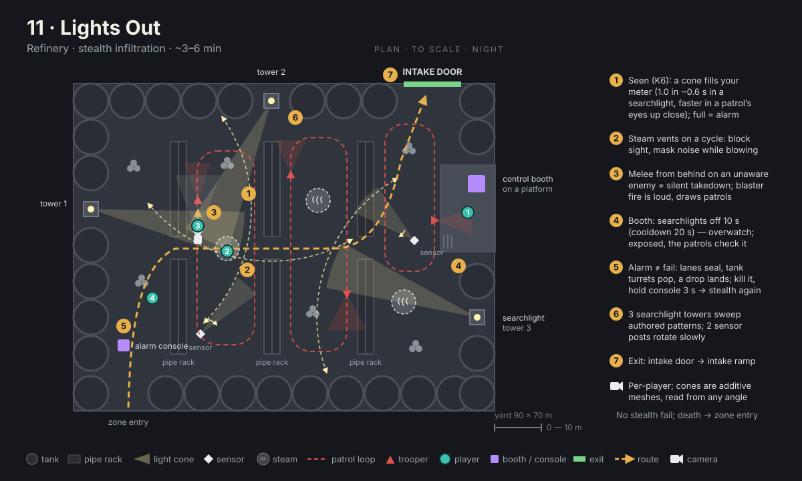

**The fantasy.** The tank yard at night, searchlights sweeping from the towers,
patrols between the pipe racks — and a party of bounty hunters who can get to the
intake door without firing a shot if they are good.

**Where it goes.** Replaces the pipe run camp (stage A, beat 2) — the yard is
night-lit and the approach to the intake ramp becomes this.

**Layout.** An `open` shell, 90 × 70 m, at night: tank rows as the borders, pipe
racks and barrel stacks as lanes of cover, **three searchlight towers** whose
cones sweep on authored patterns, **two sensor posts** (fixed cones that rotate
slowly), **steam vents** that hiss on a cycle. Stormtrooper patrols walk loops
between the racks. A **control booth** on a platform at the side.

**How it plays.**

- **Seen** (K6). Standing in a cone fills your **seen** meter (1.0 in ~0.6 s
  in a searchlight, faster in a patrol's eyes up close). Full → alarm. Steam
  from a venting pipe blocks sight and masks noise while it blows.
- **Takedowns.** The existing awareness system says who is unaware; a melee
  hit on an unaware enemy from behind is a **silent takedown** (one hit, no
  noise). Blaster fire is loud and draws the patrols.
- **The booth.** A player who reaches the control booth can kill the
  searchlights for 10 s at a time (cooldown 20 s) — *overwatch*. It is exposed:
  the patrols check it.
- **The alarm is not a fail.** The `alarm_console` mechanic the Refinery already
  runs takes over: blast doors on the pipe lanes seal, turrets pop from the tank
  walls, and a drop comes in — you can still fight through; it is just the hard
  way. The alarm can be *reset* at a console (hold interact 3 s) once the drop is
  dead, returning the yard to stealth.

**Co-op.** Stealth co-op without voice chat has to be forgiving: seen meters are
per player, the alarm needs one full meter, and the booth gives one player a
support role. Solo is the easiest version (one meter to watch).

**Camera.** Per-player. The searchlight cones are volumetric-looking (additive
cone meshes) so they read from any angle.

**Failing.** No stealth fail; death re-forms at the zone entry.

**Built from.** `tank_wall`, `pipe_rack`, `fuel_barrel`, `alarm_console` and its
alarm, stormtroopers, the awareness system. **New:** K6 (the seen meter, the
cones), the silent takedown rule, the booth toggle. Length ~3–6 min (skill
decides).

---

### 2.12 The Line — Refinery · machine-floor gauntlet

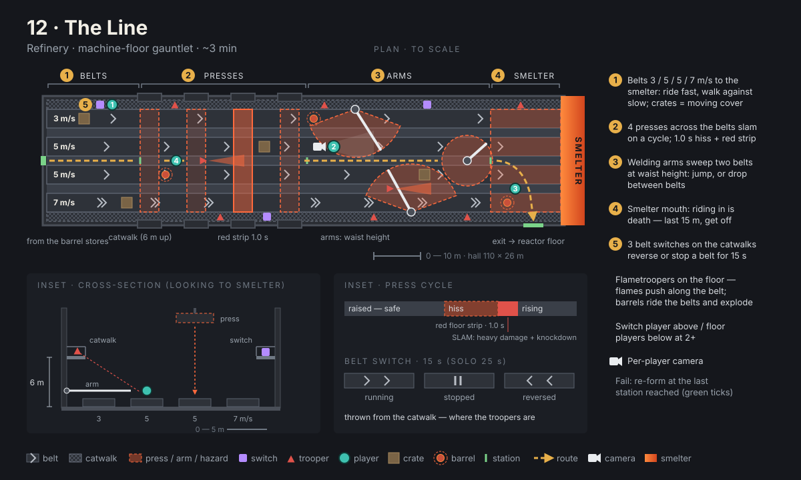

**The fantasy.** The plant's processing floor still running — conveyor belts
under you, hydraulic presses slamming, welding arms sweeping, and troopers on the
catwalks above who would love you to stand still.

**Where it goes.** Stage B, between the barrel stores and the reactor floor
(beats 4 → 5), built as an interior hall on the plant stage's roof line.

**Layout.** A hall **110 m** long and 26 m wide with **four parallel conveyor
belts** (4 m wide each) running toward the smelter end, catwalks down both
walls 6 m up, and the stations along the line:

1. **The belts** — belts move at 3, 5, 5 and 7 m/s. Walking against a fast belt
   is slow; riding one is fast. **Crates** ride the belts as moving cover.
2. **The presses** — four hydraulic presses across the belts, each slamming on a
   cycle (telegraph: the hiss and a red strip on the floor, 1.0 s). Under a press
   when it drops is heavy damage and a knockdown.
3. **The arms** — welding arms sweep across two belts at waist height: jump
   them or drop between belts.
4. **The smelter** — the belts end at the smelter's mouth. Riding a belt into it
   is death (the off-path re-form), so the last 15 m is a fight to get off the
   belts before they deliver you.

**Switches.** Three **belt switches** on the catwalks reverse or stop a belt for
15 s — a player on the catwalk can make the floor easier for the others, and
the catwalks are where the troopers are. Flametroopers on the floor (their flames
push along a belt's direction). Barrels ride the belts too, and explode.

**Co-op.** The switch player / floor players split is natural at two or more.
Solo: switches stay thrown for 25 s.

**Camera.** Per-player.

**Failing.** Re-form at the last station reached.

**Built from.** The plant's interior palette, `corridor_crate`, `fuel_barrel`,
`flametrooper`, stormtroopers. **New:** conveyor surfaces (a velocity added to
anything standing on a belt collider — the same "carried" displacement `Mover`
already records, without moving the box), presses and arms (timed kill volumes
with a mesh), switch interact. Length ~3 min.

---

### 2.13 Covert Sky — Great Forge · free flight

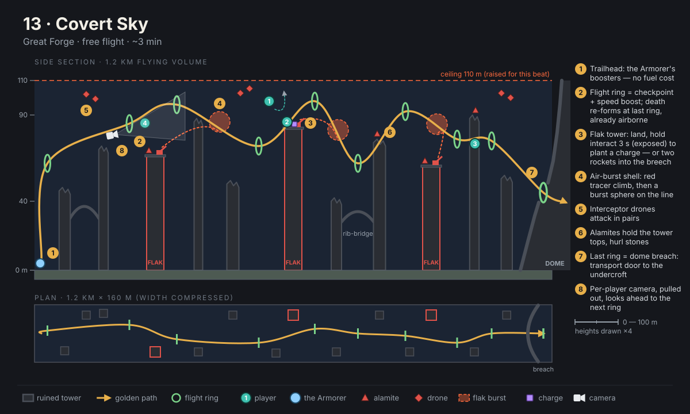

**The fantasy.** The covert flies to war. For one beat the jetpack has no limit
and the whole ruined skyline is the level: dive between towers, dogfight drones,
land on a tower top to put a charge on a gun.

**Where it goes.** Replaces the glass highway (stage A, beat 2) — the approach
to the dome is flown instead of ridden (the Forge keeps its speeder bikes for
the warlord's basin). The flight ends by diving through a breach in the dome.

**Layout.** A flying volume **1.2 km** long, 160 m wide and up to 110 m high
(its own ceiling for this beat) over the ruined city: broken towers 40–90 m
tall, arches, rib-bridges. The golden path is a line of **flight rings** — each
one flown through is a checkpoint and a speed boost — and three **flak towers**
spaced along it, each with a gun emplacement on top.

**How it plays.**

- **Flight** (K7). The jetpack burns without a fuel cost ("the Armorer's
  boosters" — a flight-rated pack for this beat, handed over at the trailhead),
  lateral air control is the existing thrust steering at a higher top speed, the
  dash is a boost, the slam is a **dive**. Landing works everywhere; walking on a
  tower top is normal on-foot play.
- **Flak.** Each flak tower fires telegraphed air-burst shells along the ring
  line (a red tracer climb, then a burst sphere). Kill it by landing on its
  top and holding interact to plant a charge (3 s, exposed), or with two rockets
  into its breech. Killing a tower quiets its stretch of sky.
- **Drones.** Interceptor drone flights attack in pairs; they are the
  dogfight. Alamites on the tower tops hurl stones and hold the landing.
- **The breach.** The last ring is the dome's breach; flying through it is the
  transport door into the undercroft.

**Co-op.** Per-player split screen; everybody flies their own line and the rings
are the shared rhythm. The charge-planting player needs cover from above — a
teammate circling the tower is the natural play.

**Camera.** Per-player, pulled out further (the dynamic camera's flight range,
widened) with a look-ahead toward the next ring.

**Failing.** Death re-forms at the last ring flown through, already airborne.

**Built from.** The jetpack, `interceptor_drone`, `alamite`, `cliff_ruin`,
`sky_mandalore`, the ceiling system (raised for the beat). **New:** K7 flight
(fuel off, top speed up), rings, the flak tower and its charge interact, a
ruined-city builder (towers are noised boxes and cylinders under `cliff_ruin`).
Length ~3 min.

---

### 2.14 Hold the Forge — Great Forge · point defence

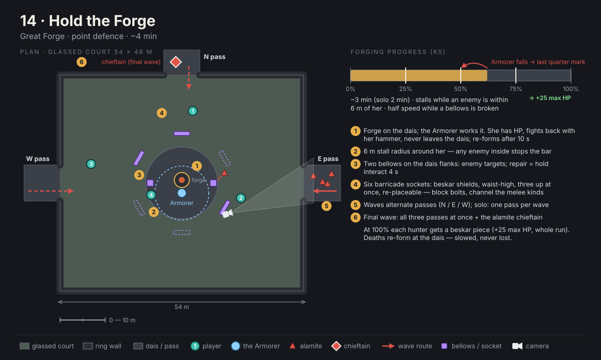

**The fantasy.** The Armorer is working beskar at the great forge, and
everything on Mandalore that wants her dead is coming through three passes. Hold
until the metal is made — and the party walks out of it stronger.

**Where it goes.** Replaces the glassed court assault (stage C, beat 6) — the
forge brazier on its dais is the centre of it already.

**Layout.** The glassed court (54 × 48 m) inside the dome ring. The **forge**
on its dais at the centre with the **Armorer** working at it. Three **passes**
(north, east, west) where waves enter. Two **bellows** on the dais' flanks, and
six **barricade sockets** around the dais.

**How it plays.**

- **The forging** (K5). A progress bar climbs from 0 to 100% over ~3 minutes
  while the Armorer works. It **stalls** while an enemy is within 6 m of her, and
  runs at half speed if a bellows is broken.
- **The Armorer** has HP (she fights back at melee range with her hammer, which
  is fun to see, but she will not leave the dais). If she falls, the forging
  resets to its last quarter mark and she re-forms after 10 s — punishing but
  not a wipe.
- **The bellows** are enemy targets. A broken one can be repaired (hold
  interact 4 s).
- **Barricades.** Each player can raise **beskar shields** in the sockets
  (three for the party at once, re-placeable): a waist-high cover wall that
  blocks bolts and channels the melee kinds. Where the barricades go is the
  party's plan.
- **Waves** alternate passes, and the last wave comes from all three at once
  with the alamite chieftain.
- **The reward.** At 100% the Armorer hands each hunter a beskar piece: **+25
  max HP for the rest of the run**. A reason to care that you can feel two beats
  later in the warlord fight.

**Co-op.** Four players can cover three passes plus the dais. Solo: the forging
is 2 minutes and each wave is a single pass.

**Camera.** Per-player.

**Failing.** Death re-forms at the dais after the normal wait. The section cannot
be lost, only slowed.

**Built from.** `armorer` (the character and her hammer), `forge_brazier`,
alamites, the assault waves, the ally escort AI (standing her ground).
**New:** K5 (the progress bar and the Armorer as a defended ally), bellows,
barricade placement, the run-scoped buff. Length ~4 min.

---

### 2.15 Tram Top — Ringworld · train-roof fight

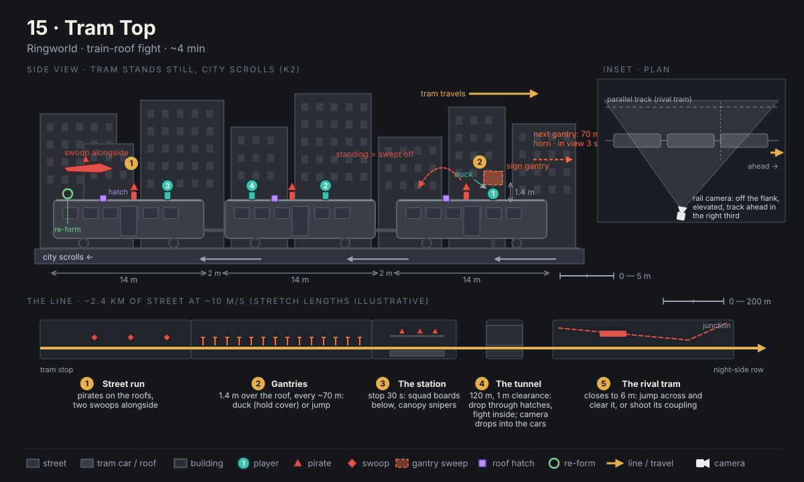

**The fantasy.** The classic: a fight on the roof of a moving train, pirates on
swoops alongside, sign gantries coming at head height, a tunnel that forces
everyone inside, and a rival train on the next track to jump across to.

**Where it goes.** Replaces the market arcade camp (beat 2): MISSIONS_OUTDOOR
already designs the tram as "the road beat here"; this is that beat, built. The
tram leaves the tram stop and delivers the party to the night-side row.

**Layout.** A treadmill arena (K2): the `tram`'s **three cars** (each 14 × 4 m,
couplers 2 m) stand still; the city scrolls. The line runs **~2.4 km** of street
(about four minutes at ~10 m/s, plus the station stop) through five stretches:

1. **Street run** — pirates on the car roofs, two swoops alongside.
2. **Gantries** — sign gantries at 1.4 m over the roof every ~70 m
   (telegraph: a horn, the gantry in view 3 s ahead). **Duck** (hold the cover
   button on the roof: a crouch) or jump it. A standing body is swept off —
   enemies too.
3. **The station** — the tram stops at a platform for 30 s: a squad boards
   through the doors below while snipers fire from the platform canopy. Hold the
   roof and the doors (the car interiors are reachable through roof hatches).
4. **The tunnel** — 120 m of tunnel with a 1 m clearance: everyone drops through
   the hatches into the cars and fights *inside* for the length of it (a car is a
   corridor on wheels), then climbs back out.
5. **The rival tram** — a pirate tram pulls alongside on the parallel track,
   gunners on its roof; it closes to 6 m. Jump across and clear it, or shoot its
   motor car's coupling. It peels off at a junction.

**Co-op.** One screen (K1): a train is linear enough that the rail camera is the
right view, and the gantries read best from the side. Four players on three cars
is the right density.

**Camera.** The **rail camera** off the tram's flank, elevated, looking across
the roofs, with the track ahead in the right third of frame so gantries are seen
coming. In the tunnel it drops into the cars (an interior framing through the
windows).

**Failing.** Swept or knocked off the roof: re-form on the rear car's roof after
the wait. Nothing resets.

**Built from.** `tram` (its fitted colliders for the roof, the interior as a
corridor), pirates, jetpack pirates, `nikto_swoop`, `street_kiosk` (platform),
`city_facade` + glow, `street_paving`. **New:** K2 (the scrolling street),
the crouch on the roof, gantry sweep volumes, the hatch transitions. Cheap after
K1 and K2. Length ~4 min.

---

### 2.16 The Mark Runs — Ringworld · pursuit

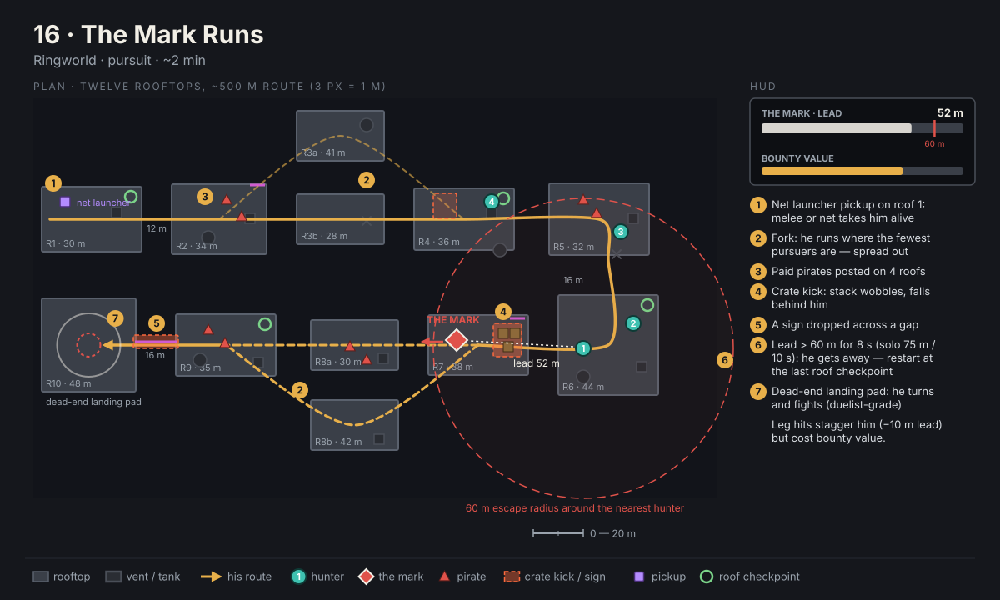

**The fantasy.** Bounty hunters hunt bounties. The mark bolts across the
rooftops with a jetpack and a head start, and the party has to keep him in reach
and bring him down — alive is worth more.

**Where it goes.** Replaces the service spine camp (beat 7): the mark is the
gunslinger warlord's paymaster, and catching him tells the party where the
terrace fight is.

**Layout.** A route across **twelve rooftops** over ~500 m, 20–40 m per roof,
gaps 6–16 m (the jetpack's range), roofs at varying heights with vents, water
tanks, antenna masts and neon signs as obstacles. Two **forks** where the mark
chooses a route (visible, not random: he goes where the fewest pursuers are).
Pirates he has paid are posted on four roofs.

**How it plays.**

- **The gap** (K8). A distance meter on the HUD: the mark's lead on the nearest
  hunter. Over **60 m for 8 s** and he gets away — the chase restarts from the
  last roof checkpoint. The mark speeds up when you are close and waits
  (catching his breath, looking back) when you are far, so it always feels tight.
- **His tricks.** He kicks crate stacks down behind him (telegraph: the stack
  wobbles), triggers a sign to fall across a gap, and calls the pirates on the
  next roof to hold you.
- **Taking him.** He can be staggered by blaster hits to the legs (a stagger
  drops his lead by 10 m) — but every hit costs **bounty value** (a bar under the
  distance meter). Melee and the **net launcher** (enemy weapon already modelled,
  here a pickup at the first roof) take him *alive*. At the final roof — a dead-end
  landing pad — he turns and fights (a duelist-grade miniboss); net him or put
  him down.
- **Bounty value** is the section's score: full value is a bonus (a rocket
  charge refill and a banner); zero value is still a clear.

**Co-op.** The fork rule makes spreading out useful: whoever is on his route
keeps him in reach. Solo: the escape threshold is 75 m and 10 s.

**Camera.** Per-player, with the objective marker locked on the mark.

**Failing.** He gets away → restart at the last roof checkpoint with him a
fixed distance ahead. Deaths re-form at the checkpoint roof.

**Built from.** A jetpack-capable enemy (the jetpack pirate's kit on the
gunslinger's or pirate's model), `net_launcher`, pirates, `city_facade`,
`neon_sign`. **New:** K8 (the path runner and its gap logic), bounty value, the
rooftop builder, crate-kick hazards. Length ~2 min.

---

### 2.17 One Way Out — Prison Rig · riot with allies

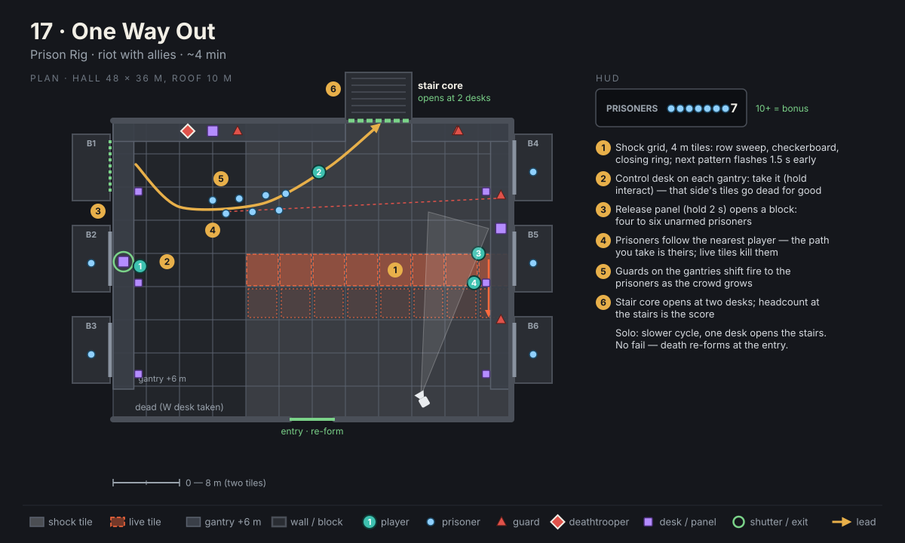

**The fantasy.** The party breaks the work floor open and the prisoners rise.
The floors are live, the guards are on the gantries, and the only way out is up
the stairs — with as many of them as you can bring.

**Where it goes.** Replaces the work floor assault (stage C, beat 5).

**Layout.** A `hall` 48 × 36 m, roofed 10 m: the work floor is a grid of **4 m
shock tiles**; **six cell blocks** along the walls behind shutters; gantries
round three sides 6 m up (the guards' positions); a **stair core** at the far end
behind a shutter.

**How it plays.**

- **The grid.** The floor's shock pattern cycles (row sweeps, checkerboard,
  a ring closing inward); the next pattern flashes 1.5 s before it goes live.
  Standing on a live tile is heavy damage and a stun. A guard **control desk** on
  each gantry runs the patterns — take a desk (fight up to it, hold interact) and
  that side's tiles go dead for good.
- **The blocks.** Each shutter opens by hitting its release panel (hold
  interact 2 s). A block releases **four to six prisoners** — allies (K5,
  the ally escort AI, unarmed: they punch, pick up dropped guard weapons, and
  follow the nearest player). The prisoner headcount is on the HUD.
- **The riot.** The more prisoners you have, the more the guards shift to
  shooting them, and the prisoners can die on live tiles. Leading them is the
  job: they follow you across the grid, so the path *you* take is theirs.
- **The stair core.** Opens once two desks are down. Reaching it with prisoners
  is the clear; **the headcount at the stairs is the score** (a bonus at ten or
  more: the prisoners hold the stairwell behind the party, and the supervisor
  deck's lieutenant fight gets no reinforcements).

**Co-op.** Four players can split: two on the desks, two leading the crowd. Solo:
the grid cycles slower and one desk opens the stairs.

**Camera.** Per-player.

**Failing.** No fail; death re-forms at the entry. Prisoners who die are gone.

**Built from.** `panel_white`, the shock floors (already the rig's hazard),
stormtroopers, `deathtrooper`, the ally escort AI, `alarm_console` (the desks).
**New:** the tile grid and its patterns, cell releases, prisoner allies (a
**prisoner model** — requested as a reference sheet, see §5), the headcount.
Length ~4 min.

---

### 2.18 The Lift — Prison Rig · ascending holdout

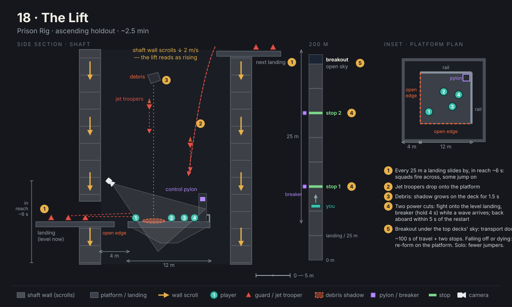

**The fantasy.** A freight lift climbing the rig's central shaft, 200 m of
white panel sliding past, landings flashing by with guards on them, troopers
dropping onto the platform from above.

**Where it goes.** The supervisor deck's far door is already "the lift: ⇒⇒ the
top decks". This makes the ride the beat instead of a loading card.

**Layout.** A treadmill arena (K2): a **12 × 12 m** lift platform with a
waist-high rail on two sides and open edges on two, a **control pylon** in one
corner. The shaft wall scrolls down past it at 2 m/s (the lift "rises") — ~100 s
of travel, plus two stops.

**How it plays.**

- **Landings pass.** Every 25 m a landing slides by; squads on it fire across
  the gap as it passes, and some jump on. A landing is in reach for ~6 s.
- **From above.** Jet troopers drop onto the platform; debris falls from the
  shaft (telegraph: a shadow growing on the deck, 1.5 s).
- **Power cuts.** Twice the lift stops (the guards cut it): a landing is level
  with the platform, and the party has to fight onto it to the **breaker panel**
  (hold interact 4 s) while a wave arrives. Then the lift restarts — anyone not
  back aboard in 5 s is left for the re-form.
- **The top.** The lift breaks out into the open under the sky of the top
  decks: the transport door, with a view.

**Co-op.** The platform is small on purpose: four players in 12 × 12 m is a
tight, fun defence. Solo: fewer jumpers.

**Camera.** Per-player, with the camera collision tuned so the shaft wall never
eats the view (the wall is set 4 m back from the open edges).

**Failing.** Falling off: re-form on the platform. Death: re-form on the
platform.

**Built from.** `panel_white`, `hull_plate_large`, stormtroopers, jet troopers
(the jetpack pirate's kit, trooper skin), the interact holds. **New:** K2 (the
scrolling shaft), the stop events. Cheapest after K2. Length ~2.5 min.

---

## 3. What each section changes in the existing runs

The runs keep their length: each section either **replaces** one beat or sits
between two as a **new** beat, and in the latter case a trek is trimmed. The
territory row stays within the 8–10 beat budget (MISSIONS_OUTDOOR §3).

| Territory | Section | Replaces / inserts | Beats after |
|---|---|---|---|
| Dune Sea | Barge Run | replaces beat 2 (dune road) | 9 |
| Dune Sea | Worm Sign | new, before beat 6 (fighting pit) | 10 |
| Spice Run | Ring Walk | new stage between A and B | 9 |
| Spice Run | Guns of the Frigate | replaces beat 7 (reactor ring) | 9 |
| Lava Flats | Magma Run | replaces beat 2 (crust causeway) | 8 |
| Lava Flats | The Chimney | new, between beats 5 and 6 | 9 |
| Crevasse | Glacier Chute | new, between beats 3 and 4 | 9 |
| Crevasse | Lamplight | new, between beats 4 and 5 | 10 |
| Storm Docks | The Squall | replaces beat 6 (trawler deck) | 8 |
| Storm Docks | Run the Pier | new, between beats 7 and 8 | 9 |
| Refinery | Lights Out | replaces beat 2 (pipe run) | 8 |
| Refinery | The Line | new, between beats 4 and 5 | 9 |
| Great Forge | Covert Sky | replaces beat 2 (glass highway) | 8 |
| Great Forge | Hold the Forge | replaces beat 6 (glassed court) | 8 |
| Ringworld | Tram Top | replaces beat 2 (market arcade) | 8 |
| Ringworld | The Mark Runs | replaces beat 7 (service spine) | 8 |
| Prison Rig | One Way Out | replaces beat 5 (work floor) | 8 |
| Prison Rig | The Lift | new, between beats 6 and 7 | 9 |

In data terms most of these are new `ZoneShell`/`ZoneEncounter` pairs
(`treadmill`, `rail`, `shaft`, `sky`, `lane` shells; `ride`, `defend`,
`escape`, `stealth`, `pursuit`, `riot`, `holdout` encounters), and three are
stages of their own (the Ring Walk, the Chimney, Lamplight), which is exactly the
case §1.9 of MISSIONS_OUTDOOR built stages for.

## 4. Recommended order

If some of these are picked, this order gets the most sections per system built:

1. **The Magma Run** — the one asked for by name. Needs only K3 (mounted
   cannon + side swing) and a lane-guided mode on the existing vehicle, on top of
   a `road` shell that already exists. Everything learned (the side swing, the
   pillion) can later be offered on every ride.
2. **The Lift** — the smallest possible K2 (one platform, one scrolling wall).
   Proves the treadmill cheaply; then **Guns of the Frigate**, **Tram Top** and
   **The Barge Run** are mostly authoring (plus K3 turrets from step 1).
3. **The Ring Walk** — the big one, K1. Once the rail camera exists, **Run the
   Pier** is a week and **Tram Top** switches to it.
4. **The Chimney** and **Hold the Forge** — cheap, and each brings one small
   system (K4, K5) that others reuse.
5. Then by taste: **Lights Out** and **Worm Sign** share K6; **Glacier Chute**
   and **Covert Sky** share K7; **Lamplight**, **The Line**, **The Mark Runs**
   and **One Way Out** each bring their own.

Every section should go through the same verification as the existing beats:
the build audit (the section's shells validate, its spawn points stand, its
landmark is visible), and the walkthrough autopilot extended with the section's
verb (the autopilot has to be able to *ride* the lane, *climb* the chimney,
*hold* the valve) — if a bot cannot finish a section, neither can a new player.

## 5. Assets

**Requested now** (`ASSETS_IMAGES.md`, *Gameplay sections — keyframe concepts*):
one painted keyframe per section — the moment the section is *for* — so the
choice between them can be made on pictures, and so the ones that are built have
an art-direction target.

**Requested when a section is picked** (listed in the same request, marked
*on pick*, so nothing is generated for a section that is not built):

| Section | Images it would need |
|---|---|
| Barge Run | none new (skiff, barge and swoop are delivered) |
| Worm Sign | `thumper_ref.png` (prop sheet) |
| Ring Walk | `ring_hull_spine.jpg` (walkway surface) |
| Guns of the Frigate | `quad_turret_ref.png`, `pirate_corvette_ref.png` (prop sheets) |
| Magma Run | none new (lava, basalt and bikes are delivered) |
| The Chimney | none new |
| Glacier Chute | `glacier_chute.jpg` (slide surface with speed-reading grooves) |
| Lamplight | `web_sheet.png` (alpha) |
| The Squall | none new |
| Run the Pier | none new |
| Lights Out | `searchlight_tower_ref.png` (prop sheet) |
| The Line | `conveyor_belt.jpg`, `hydraulic_press_ref.png` |
| Covert Sky | `flak_tower_ref.png` (prop sheet) |
| Hold the Forge | `beskar_barricade_ref.png` (prop sheet) |
| Tram Top | none new (tram delivered) |
| The Mark Runs | `rooftop.jpg` (roof surface) |
| One Way Out | `prisoner_front/side/back.png` (character sheets) |
| The Lift | `shaft_wall.jpg` + normal (the scrolling wall) |

Prop sheets become models through the existing pipeline in
[`ASSETS_MODELS.md`](ASSETS_MODELS.md); each ships procedural first.

## 6. The bench — ideas that did not make the eighteen

Kept so they are not re-invented, each with why it lost its slot:

- **Thin ice** (Crevasse) — a frozen lake that cracks under weight, the party
  forced to spread out, the ravinak's shadow following under the ice. Lost to
  the Glacier Chute only because Worm Sign is already a hazard crossing; a strong
  alternative if the chute proves expensive.
- **Mortar field** (Lava Flats) — crossing open ash under telegraphed artillery
  circles. Good filler, not a new verb.
- **Sandcrawler assault** (Dune Sea) — boarding a moving sandcrawler. Too close
  to the Barge Run.
- **Reactor meltdown escape** (Refinery) — a timed escape with blast doors
  closing on the route. Too close to the Chimney; the better finale if the
  Refinery ever needs one.
- **Harbour crossing by skiff** (Storm Docks) — the original MISSIONS_OUTDOOR
  deferral; absorbed into the Squall.
- **Crashed transport defence** (Crevasse) — the droid repairs the ship while the
  brood comes out of every crack. The Forge's defence is the better home for K5.
- **Ring gravity walk** (Ringworld) — walking up the inside curve of the ring
  until "down" has turned. Beautiful, expensive (gravity per body), no fight in
  it.
